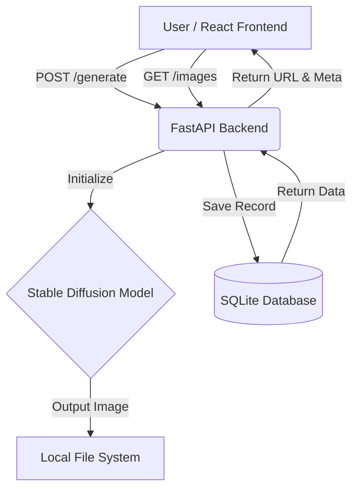

<div align="center">
  <h1>🌟 Lumina AI 🌟<br/>Intelligent Image Generator</h1>
  <p><strong>A powerful, full-stack AI image generation application powered by Stable Diffusion and FastAPI.</strong></p>
  
  <p>
    
    
    
    
    
  </p>
</div>

---

## 📖 Overview

**Lumina AI** is a state-of-the-art web application that bridges the gap between imagination and reality. By leveraging advanced Machine Learning models (Stable Diffusion), it allows users to generate high-quality, vivid images directly from simple text prompts. 

Designed with a modern, decoupled full-stack architecture, Lumina AI ensures high performance on the backend while providing a snappy, interactive, and beautiful user experience on the frontend. Every masterpiece generated is seamlessly saved to a local database, allowing users to revisit and manage their past creations in a visually stunning gallery format.

---

## ✨ Key Features

- 🎨 **Text-to-Image Generation:** Type a prompt and watch the AI bring it to life using Stable Diffusion.
- 🖼️ **Interactive Gallery:** View your complete history of generated images in a beautiful masonry grid.
- ❤️ **Favorites System:** Mark your best generations as favorites for quick access.
- 🗑️ **Image Management:** Easily delete generations you no longer need.
- ⚡ **Lightning Fast Backend:** Built on FastAPI to ensure minimal overhead and maximum performance.
- 📱 **Responsive UI:** A fully responsive React frontend that looks great on both desktop and mobile.

---

## 🚀 Tech Stack

Lumina AI is engineered using a robust, production-ready technology stack:

### **Frontend (User Interface)**
| Technology | Description |
|------------|-------------|
| **React.js** | Powers the interactive, component-based user interface. |
| **CSS3** | Vanilla CSS with modern styling (Glassmorphism, CSS Variables, Flexbox/Grid). |
| **Node.js** | Runtime for the frontend application. |

### **Backend (API & Database)**
| Technology | Description |
|------------|-------------|
| **FastAPI** | A blazing-fast, modern Python web framework used for building the backend REST APIs. |
| **Uvicorn** | The lightning-fast ASGI server that serves the FastAPI application. |
| **SQLAlchemy** | The Object Relational Mapper (ORM) for managing SQLite database records cleanly. |
| **SQLite** | A lightweight database used to store image generation history (prompts, file paths, metadata). |

### **AI & Machine Learning Engine**
| Technology | Description |
|------------|-------------|
| **Hugging Face Diffusers** | Core library to load and run the Stable Diffusion image generation pipeline. |
| **PyTorch & Accelerate** | Deep learning frameworks utilized for executing tensor operations. |
| **Transformers** | For text processing and tokenization required by Stable Diffusion. |

*(Note: There is also an alternative legacy Streamlit frontend located in `app.py`)*

---

## ⚙️ System Architecture



---

## 📂 Project Structure

```text
IMAGE-GENERATOR/
│
├── backend/                  # The FastAPI Backend System
│   ├── database.py           # Database connection & engine setup
│   ├── generator.py          # AI logic (Stable Diffusion pipeline)
│   ├── main.py               # FastAPI application & REST endpoints
│   ├── models.py             # SQLAlchemy database models
│   ├── schemas.py            # Pydantic validation schemas
│   ├── requirements.txt      # Python dependencies
│   └── generated_images/     # Folder where AI-generated images are saved
│
├── image-generator/          # The React Frontend Application
│   ├── public/               # Static assets
│   ├── src/                  # React components and styles (App, Generator, Gallery)
│   └── package.json          # Node.js dependencies
│
├── app.py                    # Alternative Streamlit UI (Legacy)
├── run_all.bat               # Master script to launch all services on Windows
└── README.md                 # Project documentation
```

---

## 🔌 API Endpoints Reference

The backend exposes a fully documented RESTful API. Once running, you can view the interactive Swagger UI at `http://localhost:8000/docs`.

| Method | Endpoint | Description |
|--------|----------|-------------|
| `POST` | `/generate` | Generate a new image from a text prompt. |
| `GET` | `/images` | Retrieve a paginated list of all generated images. |
| `GET` | `/images/{id}` | Get details of a specific image by its ID. |
| `PUT` | `/images/{id}` | Update image properties (e.g., set `is_favorite`). |
| `DELETE` | `/images/{id}` | Delete an image from the DB and file system. |

---

## 🛠️ Installation & Setup

### Prerequisites
- **Python 3.8+**
- **Node.js 16+ & npm**
- *(Optional but recommended)* A CUDA-compatible GPU for faster AI inference.

### 1. Clone the repository
```bash
git clone https://github.com/MisterSRINIVASAN/IMAGE-GENERATOR.git
cd IMAGE-GENERATOR
```

### 2. Environment Setup (Optional)
If you are using cloud-based Hugging Face models requiring authentication, create a `.env` file in the root directory:
```env
HUGGINGFACE_API_KEY=your_api_key_here
```

### 3. Run the Application (The Easy Way)
For Windows users, simply double-click or run the included batch script. This will automatically install dependencies and launch both the backend and frontend servers simultaneously!
```cmd
run_all.bat
```

### 4. Manual Startup

**Start the Backend (FastAPI)**
```bash
cd backend
python -m venv venv
venv\Scripts\activate
pip install -r requirements.txt
uvicorn main:app --reload
# API will run on http://localhost:8000
```

**Start the Frontend (React)**
```bash
cd image-generator
npm install
npm start
# React App will run on http://localhost:3000
```

---

## 🔮 Future Enhancements

- 🧠 **Multiple AI Models:** Support for SDXL or external APIs (e.g., Midjourney/OpenAI).
- 🎨 **Image Style Customization:** Add dropdowns for specific styles (e.g., "Cyberpunk", "Anime", "Photorealistic").
- ☁️ **Cloud Deployment:** Migrate database to PostgreSQL and host on AWS/Vercel/Render.
- 💾 **Download & Share:** Allow users to directly download or share generated images to social networks.

---

## 👨‍💻 Author

**Srinivasan Balaji**  
*Full Stack Developer & AI Enthusiast* 🚀  
[GitHub Profile](https://github.com/MisterSRINIVASAN)

---

## 📜 License
This project is licensed under the MIT License.
